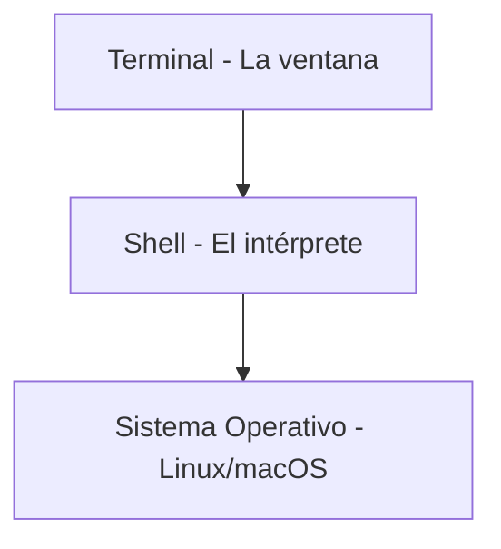
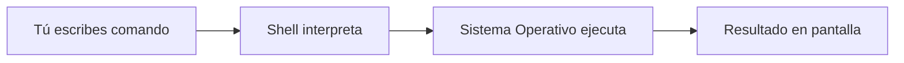

# Conceptos Básicos de la Terminal


## ¿Qué es la Terminal?

La **terminal** (también llamada consola, línea de comandos o CLI) es una interfaz de **texto** para comunicarte con tu computadora. En lugar de hacer clic en íconos y ventanas, escribes comandos con el teclado.

**¿Por qué existe?** Antes de que existieran las interfaces gráficas (Windows, macOS), la única forma de usar una computadora era escribiendo comandos. Hoy sigue siendo la forma más poderosa y eficiente de controlar un sistema.

| Interfaz Gráfica (GUI) | Terminal (CLI) |
|------------------------|----------------|
| Haces clic en íconos | Escribes comandos |
| Limitado a opciones visibles | Acceso a todo el sistema |
| Fácil de aprender | Curva de aprendizaje |
| Lento para tareas repetitivas | Automatizable |

---


## Terminal, Shell y Bash: Las Capas del Sistema

Estos términos se confunden mucho. Vamos de afuera hacia adentro:



### 1. Terminal (Emulador de Terminal)

Es el **programa/ventana** donde escribes. Solo se encarga de:
- Mostrarte texto
- Capturar lo que escribes
- Enviar tus comandos al shell

**Ejemplos de terminales:**
- Ubuntu/WSL2: GNOME Terminal, Windows Terminal
- macOS: Terminal.app, iTerm2
- Multiplataforma: Hyper, Alacritty

### 2. Shell (Intérprete de Comandos)

Es el **programa que entiende tus comandos** y los ejecuta. Cuando escribes `ls`, el shell:
1. Lee tu comando
2. Lo interpreta
3. Llama al sistema operativo
4. Te muestra el resultado

**El shell es un lenguaje de programación.** Puedes escribir scripts, usar variables, hacer loops, etc.

### 3. Bash (Un Tipo de Shell)

**Bash** = **B**ourne **A**gain **Sh**ell

Bash es el shell más común en Linux. Es una versión mejorada del shell original de Unix (sh). Cuando decimos "escribe esto en bash" o "comando de bash", nos referimos a comandos que funcionan en este shell.

| Shell | Sistema Default | Notas |
|-------|-----------------|-------|
| **Bash** | Linux, WSL2 | El estándar, más documentación |
| **Zsh** | macOS (desde Catalina) | Muy similar a Bash, más features |
| **Fish** | Ninguno | Más amigable, sintaxis diferente |
| **sh** | Sistemas antiguos | El original, muy básico |

### ¿Cómo saber qué shell estoy usando?

```bash
echo $SHELL
# /bin/bash  o  /bin/zsh
```

> **Para este curso:** Todos los comandos funcionan igual en Bash y Zsh. Si usas Fish, algunos pueden variar.

---

## El Flujo de un Comando



Cuando escribes `ls` y presionas Enter:
1. La **terminal** captura "ls" y lo envía al **shell**
2. **Bash** interpreta que quieres listar archivos
3. Bash le pide al **sistema operativo** la lista de archivos
4. El sistema responde y Bash **formatea** la salida
5. La **terminal** muestra el resultado

---

:::exercise{title="Primeros comandos" difficulty="1"}

Antes de empezar Bandit, verifica que tu terminal funciona:

1. Abre tu terminal (Ubuntu en WSL2, Terminal en Mac, o tu terminal de Linux)
2. Ejecuta `echo $SHELL` - ¿Qué shell estás usando?
3. Ejecuta `whoami` - ¿Cuál es tu nombre de usuario?
4. Ejecuta `pwd` - ¿En qué directorio estás?
5. Ejecuta `echo "Hola desde la terminal"` y observa el resultado

**Estos comandos te servirán para Bandit.**

:::

---

## Tu Primera Interacción

Cuando abres la terminal, ves algo como esto:

```bash
usuario@computadora:~$
```

Esto se llama el **prompt** y te dice:

| Parte | Significado |
|-------|-------------|
| `usuario` | Tu nombre de usuario |
| `@` | Separador |
| `computadora` | Nombre de tu máquina |
| `:` | Separador |
| `~` | Directorio actual (~ = tu carpeta home) |
| `$` | Listo para recibir comandos (# si eres root/admin) |

---


## Anatomía de un Comando: Comando, Argumentos y Banderas

Esta es la sección **más importante** de este módulo. Todo lo demás se construye sobre esto.

### La Estructura Básica

```
comando [banderas/opciones] [argumentos]
```

Piensa en ello como dar una **orden** en español:

| Español | Terminal |
|---------|----------|
| "Lista los archivos" | `ls` |
| "Lista los archivos **detalladamente**" | `ls -l` |
| "Lista los archivos **de Documents**" | `ls Documents` |
| "Lista los archivos **detalladamente** **de Documents**" | `ls -l Documents` |

---

### 1. ¿Qué es un COMANDO?

Un **comando** es un programa o instrucción que le dices a la computadora que ejecute. Es el **verbo** de tu oración.

```bash
ls        # comando: "listar"
cd        # comando: "cambiar directorio"
cp        # comando: "copiar"
rm        # comando: "remover/eliminar"
echo      # comando: "imprimir/repetir"
cat       # comando: "concatenar/mostrar"
```

**¿De dónde vienen los comandos?**
- Son programas instalados en tu sistema
- Están guardados en carpetas como `/bin/`, `/usr/bin/`
- Puedes ver dónde está un comando con `which`:

```bash
which ls
# /usr/bin/ls

which python3
# /usr/bin/python3
```

---

### 2. ¿Qué es un ARGUMENTO?

Un **argumento** es la **información** que el comando necesita para trabajar. Es el **sustantivo** de tu oración - sobre qué actúa el comando.

```bash
cd Documents          # "Documents" es el argumento (a dónde ir)
cat archivo.txt       # "archivo.txt" es el argumento (qué mostrar)
cp original.txt copia.txt   # dos argumentos (qué copiar, cómo llamarlo)
rm basura.txt         # "basura.txt" es el argumento (qué eliminar)
echo "Hola mundo"     # "Hola mundo" es el argumento (qué imprimir)
```

**Argumentos múltiples:**

```bash
# Copiar: necesita 2 argumentos (origen y destino)
cp archivo1.txt archivo2.txt

# Mover varios archivos a una carpeta
mv file1.txt file2.txt file3.txt carpeta/

# Crear varios directorios
mkdir dir1 dir2 dir3
```

**Sin argumentos = comportamiento default:**

```bash
ls              # lista el directorio ACTUAL (default)
ls Documents    # lista el directorio Documents (argumento)

cd              # va a tu HOME (default)
cd /tmp         # va a /tmp (argumento)
```

---

### 3. ¿Qué es una BANDERA (Flag/Opción)?

Una **bandera** (también llamada flag u opción) **modifica** cómo funciona el comando. Es el **adverbio** de tu oración.

**Formato corto (una letra, un guion):**
```bash
ls -l      # -l = "long" (formato largo/detallado)
ls -a      # -a = "all" (todos, incluyendo ocultos)
ls -h      # -h = "human readable" (tamaños legibles)
```

**Formato largo (palabra completa, dos guiones):**
```bash
ls --all           # igual que -a
ls --help          # muestra ayuda
rm --recursive     # igual que -r
```

**Combinando banderas cortas:**
```bash
# Estas tres formas son EQUIVALENTES:
ls -l -a -h
ls -la -h
ls -lah
```

---

### Ejemplos Desglosados

#### Ejemplo 1: `ls -la /home`

| Parte | Tipo | Significado |
|-------|------|-------------|
| `ls` | comando | listar archivos |
| `-l` | bandera | formato largo (detalles) |
| `-a` | bandera | mostrar archivos ocultos |
| `/home` | argumento | qué directorio listar |

#### Ejemplo 2: `cp -r carpeta/ backup/`

| Parte | Tipo | Significado |
|-------|------|-------------|
| `cp` | comando | copiar |
| `-r` | bandera | recursivo (copiar todo el contenido) |
| `carpeta/` | argumento 1 | qué copiar (origen) |
| `backup/` | argumento 2 | dónde copiar (destino) |

#### Ejemplo 3: `grep -i "error" archivo.log`

| Parte | Tipo | Significado |
|-------|------|-------------|
| `grep` | comando | buscar texto |
| `-i` | bandera | ignorar mayúsculas/minúsculas |
| `"error"` | argumento 1 | qué buscar (patrón) |
| `archivo.log` | argumento 2 | dónde buscar |

#### Ejemplo 4: `rm -rf directorio/`

| Parte | Tipo | Significado |
|-------|------|-------------|
| `rm` | comando | eliminar |
| `-r` | bandera | recursivo (todo el contenido) |
| `-f` | bandera | force (sin preguntar) |
| `directorio/` | argumento | qué eliminar |

**⚠️ CUIDADO:** `rm -rf` es muy peligroso. Elimina todo sin preguntar.

---

### Banderas Comunes que Verás en Muchos Comandos

| Bandera | Significado común |
|---------|-------------------|
| `-h`, `--help` | Mostrar ayuda |
| `-v`, `--verbose` | Modo verboso (más información) |
| `-q`, `--quiet` | Modo silencioso (menos output) |
| `-r`, `--recursive` | Aplicar a subdirectorios |
| `-f`, `--force` | Forzar (sin confirmación) |
| `-i`, `--interactive` | Preguntar antes de actuar |
| `-n`, `--dry-run` | Simular sin ejecutar realmente |
| `-a`, `--all` | Todos (incluyendo ocultos) |

---

### Banderas con Valores

Algunas banderas necesitan un valor después:

```bash
# Bandera corta con valor (espacio o sin espacio)
head -n 5 archivo.txt       # -n necesita un número
head -n5 archivo.txt        # equivalente

# Bandera larga con valor (= o espacio)
grep --context=3 "error" log.txt
grep --context 3 "error" log.txt    # equivalente
```

---

:::exercise{title="Identificar partes de comandos" difficulty="1"}

Para cada comando, identifica: **comando**, **banderas** y **argumentos**:

1. `pwd`
2. `ls -la`
3. `cd /var/log`
4. `cp -r fotos/ backup/`
5. `grep -n "TODO" *.py`
6. `rm -rf node_modules/`
7. `cat archivo1.txt archivo2.txt`
8. `head -n 20 datos.csv`

**Escríbelo así:**
```
comando: X
banderas: X, X
argumentos: X, X
```

:::

:::exercise{title="Construir comandos" difficulty="2"}

Escribe el comando para cada descripción:

1. Listar archivos con detalles y tamaños legibles
2. Copiar la carpeta `proyecto/` a `proyecto_backup/` incluyendo subcarpetas
3. Buscar la palabra "password" en el archivo `config.txt` ignorando mayúsculas
4. Eliminar el archivo `temp.txt` pidiendo confirmación
5. Mostrar las primeras 10 líneas de `log.txt`
6. Crear los directorios `src`, `tests` y `docs` con un solo comando

:::

:::exercise{title="Experimentar con banderas" difficulty="2"}

Ejecuta estos comandos y compara los resultados:

```bash
# Sin banderas vs con banderas
ls
ls -l
ls -la
ls -lah

# Orden de banderas (¿importa?)
ls -la
ls -al

# Banderas largas vs cortas
ls --all
ls -a

# ¿Qué hace cada bandera de ls?
ls --help | head -40
```

**Preguntas:**
1. ¿Qué información extra muestra `-l`?
2. ¿Qué archivos extra muestra `-a`?
3. ¿Cómo cambia `-h` los tamaños?

:::

---

## Comandos Esenciales para Empezar

### `whoami` - ¿Quién soy?

```bash
whoami
# Resultado: tu_usuario
```

### `pwd` - ¿Dónde estoy?

**P**rint **W**orking **D**irectory - muestra tu ubicación actual.

```bash
pwd
# Resultado: /home/tu_usuario
```

### `echo` - Imprimir texto

```bash
echo "Hola mundo"
# Resultado: Hola mundo

echo $USER
# Resultado: tu_usuario (imprime el valor de una variable)
```

### `clear` - Limpiar pantalla

```bash
clear
```

> **Tip:** También puedes usar `Ctrl + L` para limpiar la pantalla.

### `date` - Fecha y hora

```bash
date
# Resultado: Thu Jan 23 10:30:00 CST 2026
```

### `cal` - Calendario

```bash
cal
# Muestra el calendario del mes actual
```

---

## Obtener Ayuda

### `--help` - Ayuda rápida

```bash
ls --help
```

### `man` - Manual completo

```bash
man ls
```

Dentro del manual:
- `q` para salir
- `↑/↓` o `j/k` para navegar
- `/palabra` para buscar

### `tldr` - Ejemplos prácticos (instalar aparte)

```bash
tldr ls
# Muestra ejemplos comunes de uso
```

---

## Errores Comunes

### "command not found"

```bash
$ pythno
bash: pythno: command not found
```

**Causa:** El comando no existe o está mal escrito.  
**Solución:** Revisa la ortografía (`python` no `pythno`).

### "Permission denied"

```bash
$ ./script.sh
bash: ./script.sh: Permission denied
```

**Causa:** No tienes permisos para ejecutar.  
**Solución:** Aprenderás sobre permisos más adelante.

### "No such file or directory"

```bash
$ cd carpeta_que_no_existe
bash: cd: carpeta_que_no_existe: No such file or directory
```

**Causa:** La ruta no existe.  
**Solución:** Verifica que escribiste bien el nombre.

---

## Cancelar un Comando

Si un comando se queda corriendo o quieres cancelar:

| Atajo | Acción |
|-------|--------|
| `Ctrl + C` | Cancela el comando actual |
| `Ctrl + D` | Cierra la terminal (EOF) |
| `Ctrl + Z` | Suspende el comando (cuidado, sigue en memoria) |

:::exercise{title="Prueba cancelar" difficulty="1"}

1. Ejecuta `sleep 100` (espera 100 segundos)
2. Presiona `Ctrl + C` para cancelarlo
3. Observa cómo vuelve el prompt

:::

---

---

## Ejercicios Prácticos

:::exercise{title="Exploración inicial" difficulty="1"}

Ejecuta estos comandos y anota qué hace cada uno:

```bash
whoami
hostname
pwd
date
cal
uptime
```

**Pregunta:** ¿Cuánto tiempo lleva encendida tu computadora?

:::

:::exercise{title="Usando opciones" difficulty="1"}

Experimenta con opciones:

```bash
# Sin opciones
date

# Con opción de formato
date +"%Y-%m-%d"

# Solo hora
date +"%H:%M:%S"
```

**Pregunta:** ¿Qué significa `%Y`, `%m`, `%d`?

:::

:::exercise{title="Obtener ayuda" difficulty="2"}

1. Ejecuta `man ls` y encuentra:
   - ¿Qué hace la opción `-h`?
   - ¿Qué hace la opción `-S`?
2. Sal del manual con `q`
3. Prueba `ls --help | less` para ver la ayuda con scroll

:::

---

## Prompts para LLM

Cuando te atores o quieras profundizar, usa estos prompts:

:::prompt{title="Entender un error" for="ChatGPT/Claude"}

Estoy aprendiendo a usar la terminal de Linux. Ejecuté este comando:

```
[pega tu comando aquí]
```

Y obtuve este error:

```
[pega el error aquí]
```

¿Qué significa este error y cómo lo soluciono?

:::

:::prompt{title="Explicar un comando" for="ChatGPT/Claude"}

Explícame qué hace este comando de terminal paso a paso, como si fuera principiante:

```
[pega el comando aquí]
```

Desglosa cada parte: el comando base, las opciones y los argumentos.

:::

---

## Resumen

| Concepto | Descripción |
|----------|-------------|
| Terminal | Ventana donde escribes comandos |
| Shell | Intérprete (Bash, Zsh) |
| Prompt | Indicador que espera tu comando |
| Comando | Instrucción + opciones + argumentos |
| `Ctrl + C` | Cancelar comando |
| `Ctrl + L` | Limpiar pantalla |
